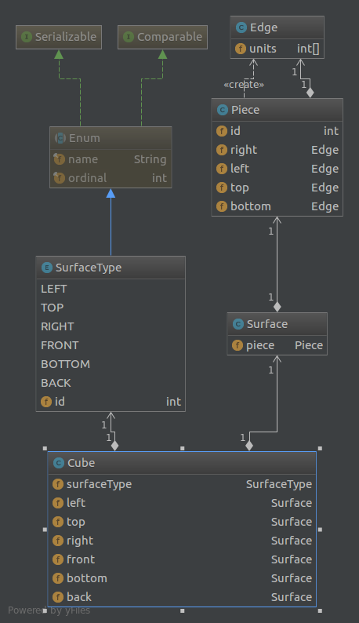

# Cube Puzzle Solver

[](https://travis-ci.org/OnurKaraduman/j4puzzle)

This is the project for solving simple cube puzzle.

The following picture shows the simple cub puzzle pieces:

 

### Technology stack
* [JUnit](http://junit.org/junit4/)
* [Lombok](https://projectlombok.org/) For only easy logging
* [log4j](https://logging.apache.org/log4j/2.x/)


### Software Design Overview

#### Data Structure
 
 The following screenshot shows the data structure:
 
 
 
 
### Building

There are two maven profile named INT and EXT. They are defined for way to get puzzle piece input. 

Note: Java8 is required.

**With Int profile**

To get easy run, I encoded the input pieces to source code. You can run that input directly with int profile. 
In addition, this profile is default profile. If you build without any arguments, this profile will work.

````sh
mvn clean install -Dsource=int
`````

**With EXT profile**

You can specify the file input to program.

The following displays the embedded puzzle piece input. Your file should be in that format.

````
  o  
 ooo 
ooooo
 ooo 
  o  
o o o
ooooo
 ooo 
ooooo
o o o
  o  
 oooo
oooo 
 oooo
  o  
 o o 
oooo 
 oooo
oooo 
oo o 
 o o 
ooooo
 ooo 
ooooo
o o  
 o o 
 oooo
oooo 
 oooo
oo oo
````

````sh
mvn clean install -Dsource=ext -Dfile.path=<blablabla.txt>
`````
